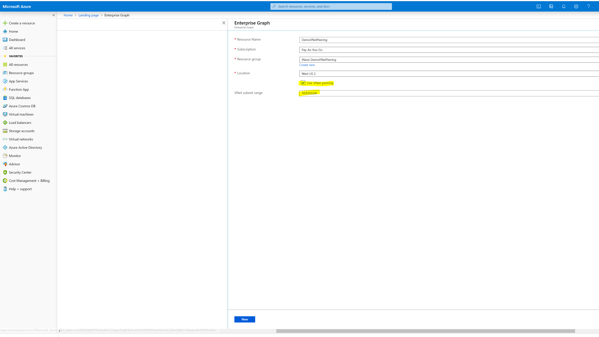

# VNet Peering

Azure virtual network peering enables users to seamlessly connect to two Azure virtual networks across Azure Tenants. Once the connection is successful, the virtual networks appear as one network which can be easily connected to. The traffic between virtual machines in the peered virtual networks is routed through the Microsoft backbone infrastructure. This is similar to the way network traffic, through private IP addresses, is routed between virtual machines in the same virtual network.

To enable VNet Peering in Enterprise Graph, ensure that the "Use VNet Peering" box is checked when you provision it. The VNet subnet range is the range of the private IP addresses that can be used by the physical resources in MS subnet. At minimum, the range should have 128 IP addresses.


# Steps to enable VNet Peering in Enterprise graph

Both customer and Microsoft admins are required to enable VNet Peering.

* On the customer VNet, the customer admin assigns the network contributor role to a Microsoft admin user from MEG team.
* On the MS MEG VNet, the MEG admin assigns the network contributor role to a customer admin user. 
* The MEG admin enables VNet peering. Once enabled, the customer admin can run the following steps to configure NSG rules to block the traffic from MS VNet to Customer VNet to improve security.

    * Install Powershell 6.2 on a VM in the customer VNet.
    * Open Powershell in administrator mode.
    * Run "``Set-ExecutionPolicy unrestricted``"
    * Run "``Connect-AzAccount``", and follow the instructions to log in to the customer subscription.
    * Obtain the nsg_Az.ps1 script from the MS Admin, and use the following command to configure the NSG rules.
    ```
    nsg_Az.ps1 <ms-subscription> <ms-resource-group> <ms-vnet> <customer-subscription> <customer-resource-group> <customer-vnet>
    ```