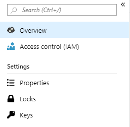
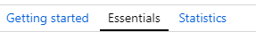
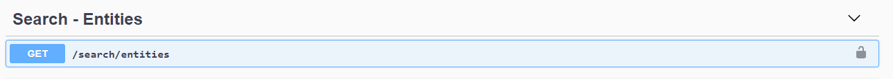
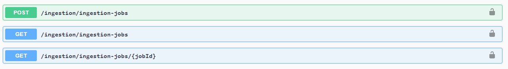
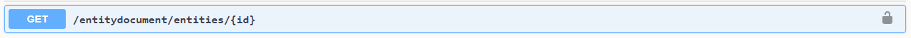

# API references and Swagger

Enterprise Graph includes APIs that you can use to create and query your graph, and which can be tested out using Swagger.

## Viewing the Swagger API page

To obtain the URL to see your Swagger API page, go to the Overview section in the navigation panel to the left:

And then choose the 'Essentials' tab:

At the top right of this screen, your API URL will be listed under WEB API URL. When you open this URL in a web browser, you will see the Swagger API page.

## Enterprise Graph APIs

The Enterprise Graph APIs allow you to complete the same steps as in the interface to create and use your graph.

**Entity search API**

The entity search API is where you can free-text search your graph, i.e. return any entity with the search string in it.

**Ingestion APIs**

Ingestion APIs enable you to run new ingestion jobs and to check the status of currently-running jobs.

**Entity document API**

The entity document API enables you to see all information in the graph for a given entity.

All of the APIs for the system and their associated object are documented on this page, and you can run queries and test them out using the Swagger interface.