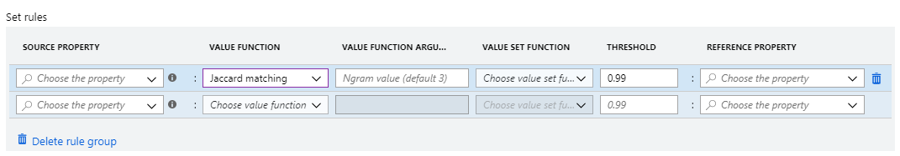
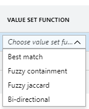

# Conflation rules

When we are comparing complex entities to see if they should be merged into a single entity under the rules of conflation, we often end up comparing sets of values rather than just a single value. 

For example, if we were comparing two entities representing business projects, the project name would be a single string, which we can compare with exact match or some fuzzy matching rules. However, if we are comparing the set of people assigned to one entity versus the set of people assigned to the other, the situation is more complex. 

To compare the two sets, we define a Value Set Function, and to compare the pair values from the set we define a Value Function. In the interface, it looks like:



The Value Set Function returns a score between 0 and 1, where 1 means perfect match and 0 means non-match. You can manually specify a threshold for the matching method, and above that number the function will return a match.

## Value Functions

Value Functions are used for comparison of individual elements.


###ExactMatching###
This is an exact matching function. It returns either 0 or 1, where 1 means a match. 
 
Positive example: “Barack Obama”, “Barack Obama”, will return 1 
Negative example: “Barack Obama”, “Barack Obma”, will return 0 

###Jaccard Matching###
This is a token-based function where the tokens are n-grams. We default to n=3. N-grams are generally computing by sliding a window of size n on the string and returning what is in the window as the tokens. For example, for 'Microsoft', the 3-grams tokens are {mic, icr, cro, ros, oso, sof, oft}. 

After computing the n-gram set for the original strings, the matching score is the Jaccard Coefficient of the two n-gram sets. 

```JaccardSimilarity(s1, s2) = (|s1 ∩ s2|)/(|s1 ∪ s2|)``` where |s1| and |s2| are the lengths of s1, s2. 
 
This function is recommended if there are variations in the token arrangement of the strings: 
**Positive example:** 'Microsoft Corporation', 'The Corporation of Microsoft', will return 0.88 
**Positive example:** 'Corporate of Microsoft', 'Microsoft Corporate', will return 1 
 
However, it will not do a good job when the string values match with some character variations. 
**Negative example:** “apple”, “apaple”, will return 0.166 

###Jaccard Containment###
This function is useful when we want a score to measure the containment of a string value into another string while considering token and character variation. This is a token-based matching function similar to Jaccard Matching. However, it does not compute the n-grams set similarity, but rather computes the n-gram set containment.

```JaccardContainment(s1, s2)=(|s1 ∩ s2 |)/(min(|s1 |, |s2 |))``` where |s1| and |s2| are the lengths of s1, s2.

JaccardContainment returns a high matching score for the following cases:

**Positive example:** 'Microsoft Company', 'Microsoft has a new vision to be a growth-mindset company', will return 1
**Positive example:** 'Barack Hussein Obama', 'Obama', will return 1
**Positive example:** 'Washington Univ.', 'University of Washington', will return 1

###Edit distance ###
This function computes the minimum number of character edits (insertion, deletion, and substitution) required to change one string into another.

For two strings s1 and s2:

```EditDistance(s1, s2) = 1 - (Edit_Distance(s1,s2))/(min(|s1 |, |s2 |))``` where |s1| and |s2| are the lengths of s1, s2.

The EditDistance function should be considered when the string values match with some character variations.

**Positive example:** 'Telephone', 'Telphene', will return 0.75
**Positive example:** 'Micrsoft Corprration', 'Microsoft Corporation', will return 0.89

However, it is not recommended if there are variations in the tokens arrangement of the strings. For example: 

**Negative example:** 'Micrsoft Corprration', 'Corporation Microsoft', will return 0.15

###Number similarity###
The distance between two numbers scaled using the larger number:

**Negative example:** '5','10' will return 0.5
**Positive example:** '5','5' will return 1

###Date Day and Date Year similarity###

Calculate difference between two DateTime values, normalized by the provided maximum distance value.

**Positive example** '2012' vs. '2013' will return 0
**Positive example** '2012.12.01' vs. '2013' will return 0 

By default, if either of the two dates are year only the comparison will be evaluated based on year similarity only. For example, 2012 and 2012-11-24 will yield 1, as a comparison of 2012 and 2012 is 1


## Value Set Functions

Value Set Functions are used for comparison of sets.



###Best Match###

The default set matching function. It should be used when matching a single value is enough to consider that the property match.

The following sets will result in a high matching score:

**Positive example:** {“Microsoft”, “MS”, “MS corp”}, {“MS”}
**Positive example:** { “Robyn Rihanna Fenty”, “Rihanna”, “Barbadian Pop Queen”, “Barbados Queen of Pop”, “RiRi”}, {“Caribbean Queen”, “New Queen of Pop”, “R&B Princess”, “Princess of Pop”, “RiRi”}

A single value matching is enough to return a high matching score.

###Fuzzy Jaccard###
This function computes the similarity of two sets of string values, and it takes into account fuzzy string matching. The values within the sets are matched using any of the string matching functions as in the previou section. Then a final aggregated set matching score is computed as follows:

Given two sets of values A and B, first we computer the fuzzy overlap FO as follows:

```FO(A,B)=∑_(∀ a∈A)〖argmax_(∀b∈B) (sim(a,b))〗```

Where sim is one of the string matching functions, and argmax_(∀b∈B) (sim(a,b)) means return the best similarity score between string value a and all the b∈B. After that the final fuzzy set similarity score is computed as follows:

```FuzzyJaccard(A,B)=(FO(A,B))/(|A∪B|)```

Where |A∪B| is the number of values in the union set of A and B.

FuzzyJaccard will match well in the following cases and return high similarity score:

**Positive example:** {“Microsoft”, “Apple”, “Google”, “Amazon”}, {“Microsoft”, “Apple”, “Google”, “Intel”}
**Positive example:** {“Microsoft”, “Applle”, “Google”, “Intel”}, {“Microsft”, “Apple”, “Googl”, “Intel”}

It will not return high matching scores for the following cases:

**Negative example:** {“Microsoft”, “Applle”, “Google”, “Intel”}, {“Microsft”, “Apple”}
**Negative example:** {“Microsoft”, “Applle”, “Google”, “Intel”}, {“Microsft”}


###Fuzzy Containment###
This function computes fuzzy containment of the values. It is useful for cases when matching sets where one of the sets has significantly fewer elements than the other. In that case, fuzzy set similarity will not be high, but fuzzy set containment will be high. To compute the final score, first we compute the fuzzy overlap FO as we did in Fuzzy Jaccard above.

Then the final score will be computed as follows:

```FuzzyContainment(A,B)=(FO(A,B))/(min⁡(|A|,|B|))```

Where |A|,|B| are the sizes of the two sets A and B, respectively.

Fuzzy Containment will return high matching scores for the following cases:

**Positive example:** {“Microsoft”, “Applle”, “Google”, “Intel”}, {“Microsft”, “Apple”}
**Positive example:** {“Microsoft”, “Applle”, “Google”, “Intel”}, {“Microsft”}
**Positive example:** {“Microsoft”, “Apple”, “Google”, “Amazon”}, {“Microsoft”, “Apple”, “Google”, “Intel”}
**Positive example:** {“Microsoft”, “Applle”, “Google”, “Intel”}, {“Microsft”, “Apple”, “Googl”, “Intel”}


