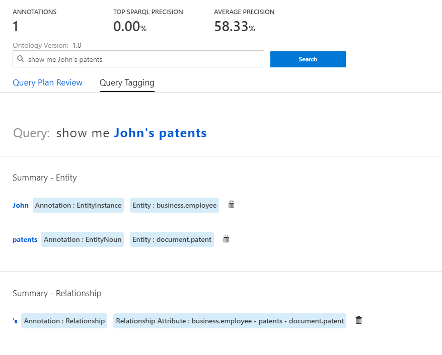

# Different Annotation Types 

This section will define and provide examples for the different types of tagging operations a user can do. This guide assumes that you have completed the Conversational AI overview tutorial, and are familiar with how the tool works.

| Annotation Type        | Description           
| ------------- |-------------
| Condition     | A condition that can be applied to an entity. For example, ‘young’ can be set to mean employees less than the age of 30. 
| Entity      | An entity describes a concept. For example, employees, cities, and interests are all different entities.       
| Entity Attribute | A property of an entity. For example, the ‘first name’ of an ‘employee’ is an entity attribute of the entity ‘employee’.  
| Instance | An example from the data of an entity. For example, ‘London’ is an Instance of the Entity ‘City’  
| Relationship | The relationship between two entities. For example, in the query ‘employees in California’, ‘in’ is the relationship between ‘employees’ and California.’

## Condition

**Entry level** can be a conditional attribute of employee in this case, with a start date specification. 

## Entity

**Employees** is an Entity. 

## Entity Attribute

Titles is an attribute of patent. 

## Instance

John is an instance of an employee. 

Unlike the other types of annotations, users cannot create a new instance with the tool; only existing previous instances. For example, adding a new name of an employee entity must happen upstream at the data ingestion stage, not at the Conversational AI tooling level. 

## Relationship

The **‘s** shows the relationship between John and his patents. 

