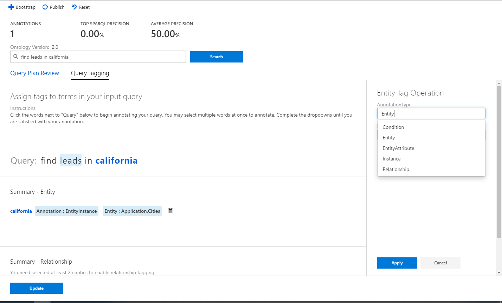

# Overview: Conversational AI Overview

In this tutorial, you'll learn to:

> * Rank interpretations 
> * Annotate an utterance
> * Update the language models 

## Prerequisites

- Have completed all the essential steps to build the graph.

## Introduction

The Conversational AI tool, part of Microsoft Enterprise Graph lets users write natural language queries to generate SPARQL, create and annotate the language models. Annotating means that users can interpret and improve the result of a given query through continual feedback, and more on this will be covered later. This document will describe the Sasho tool’s main functions. 

The Sasho tooling is found in the Conversational AI section, pictured below: 

## Language Models

Sasho assumes that you already have an ontology and data in place. Behind the scenes, Sasho builds language models on top of the ontology. Language models are a set of generated rules which Sasho uses to interpret natural language queries. Users can generate the baseline language model by clicking the Bootstrap button.

Of course, the language models will not be perfect out of the box and must be improved. The process of improvements is the Annotations aspect of the Sasho tooling, detailed below. 

## Annotations

Within Annotations, there are 2 sections: Query Plan Review and Query Plan Tagging. 

### Query Plan Review 

The goal of this section is to help Sasho understand the best interpretation of a natural language query. The basic steps are as follows: When a user enters in a query, the result will be several visual interpretations, in the order of confidence. The user has the option to rate the interpretations so that Sasho can improve. Behind the interpretations themselves are a graphical and thus more interpretable view of a SPARQL query. 

The interpretations are ordered from most confident to least confident. If there are multiple interpretations, users can judge the interpretations as Perfect, Good, Fair, Bad, or Not Judged. Once the user judges the interpretation, Sasho will incorporate the feedback, rerun the query, and provided an updated order of visual interpretations. In this example, the #3 interpretation looks better than the #1 interpretation. Sasho has tried to infer that workers actually means employees, but it is not very confident about it. 

By labelling the #1 interpretation as bad, #2 as good, and the #3 interpretation as Perfect, the language models will update and reorder the results. The ‘bad’ interpretation is now gone. 

###  Query Plan Tagging

There will be queries which Sasho does not completely understand, due to the language models missing some type of information. In these instances, users can annotate on a query. The process to do this is described below: 

In this same example, the word ‘workers’ and ‘know’ is not recognized. We’ll focus on ‘workers.’ ‘Workers’ needs to be classified as a synonym of ‘employee’, which is where the tool can help. Sasho has already tried to infer that ‘workers’ is ‘employees’ in the interpretations, but this will help further improve the language model. 

After clicking on Query Tagging, users can click one or multiple terms in the query and assign them to a part of the ontology.

‘Workers’ needs to be annotated. When the user clicks on ‘workers’, the Entity Tag Operation automatically opens. 

Because ‘workers’ is an entity, the Annotation Type is Entity. In the ontology, there is an entity type for employees, which is what the user finds and selects. The image below shows this operation. 

After selecting the operation, the user can update the model, and the query will rerun. 

One key difference in the interpretation now versus before is that the business employee node is now colored in blue. This means that because we’ve linked ‘worker’ and ‘employee’ through the query tagging, Sasho knows that the central point of the question is around the business employee. Previously, it had to infer this. Compare the original interpreted query with the new interpretation after the annotations that were made:

**Old Interpretation**

**New Interpretation** 

In summary, we taught Sasho to recognize ‘workers’ as a synonym for ‘employees’. 

Finally, Sasho tracks the precision of the different queries run in the instance. Users can use this to track how Sasho is improving. 

## Different Entity Types 

This section will define and provide examples for the different types of tagging operations a user can do. 

| Annotation Type        | Description           
| ------------- |-------------
| Condition     | A condition which can be applied to an entity. For example, ‘young’ can be set to mean employees less than the age of 30. 
| Entity      | An entity describes a concept. For example, employees, cities, and interests are all different entities.       
| Entity Attribute | A property of an entity. For example, the ‘first name’ of an ‘employee’ is an entity attribute of the entity ‘employee’.  
| Instance | An example from the data of an entity. For example, ‘London’ is an Instance of the Entity ‘City’  
| Relationship | The relationship between two entities. For example, in the query ‘employees in California’, ‘in’ is the relationship between ‘employees’ and California.’

### Condition

**Entry level** can be a conditional attribute of employee in this case, with a start date specification. 

### Entity

**Employees** is an Entity. 

### Entity Attribute

Titles is an attribute of patent. 

### Instance

John is an instance of an employee. 

Unlike the other types of annotations, users cannot create a new instance with the tool; only existing previous instances. To add a new name of an employee for example, this must be done upstream at the data ingestion stage, not at the Sasho tooling level. 

### Relationship

The **‘s** shows the relationship between John and his patents. 

## Conclusion

The Sasho tooling provides a visual, interpretable mechanism to interpret and improve natural language queries. Please reach out to the Marcel Migration team for any questions.  