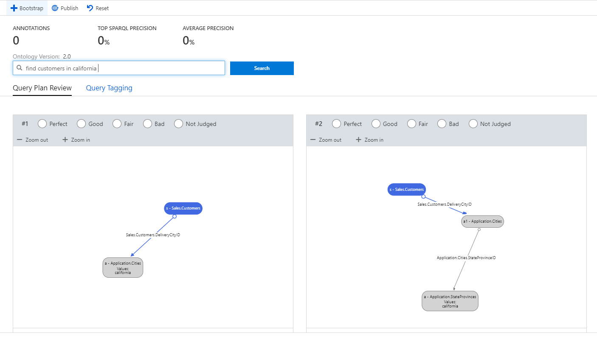

# Tutorial: Create an intent classifier model

In this tutorial, you'll learn to:

> [!div class="checklist"]
> * Rank interpretations 
> * Annotate an utterance
> * Update the language models 

## Prerequisites

- Have completed all the essential steps to build the graph.

## Introduction

The Conversational AI tool, part of Microsoft Enterprise Graph lets users write natural language queries to generate SPARQL, create and annotate the language models. Annotating means that users can interpret and improve the result of a given query through continual feedback, and more on this will be covered later. This document will describe the Sasho tool’s main functions. 

The Sasho tooling is found in the Conversational AI section, pictured below: 

## Language Models

Sasho assumes that you already have an ontology and data in place. Behind the scenes, Sasho builds language models on top of the ontology. Language models are a set of generated rules which Sasho uses to interpret natural language queries. Users can generate the baseline language model by clicking the Bootstrap button.

Of course, the language models will not be perfect out of the box and must be improved. The process of improvements is the Annotations aspect of the Sasho tooling, detailed below. 

## Annotations

Within Annotations, there are 2 sections: Query Plan Review and Query Plan Tagging. 

### Query Plan Review 

The goal of this section is to help Sasho understand the best interpretation of a natural language query. The basic steps are as follows: When a user enters in a query, the result will be several visual interpretations, in the order of confidence. The user has the option to rate the interpretations so that Sasho can improve. Behind the interpretations themselves are a graphical and thus more interpretable view of a SPARQL query. 

The interpretations are ordered from most confident to least confident. If there are multiple interpretations, users can judge the interpretations as Perfect, Good, Fair, Bad, or Not Judged. Once the user judges the interpretation, Sasho will incorporate the feedback, rerun the query, and provided an updated order of visual interpretations. In this example, the #3 interpretation looks better than the #1 interpretation. Sasho has tried to infer that workers actually means employees, but it is not very confident about it. 

###  Query Plan Tagging