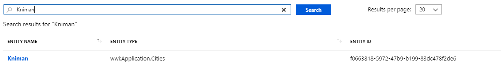

# Querying your graph

Once your graph is set up, you can query it in one of two ways - through free text search or through a SPARQL graph query.

## Graph query

To get entity-based answers from your graph based on its properties and relations, you can write SPARQL queries. A full discussion of SPARQL is outside the scope of this documentation, but check out the <a href="https://en.wikipedia.org/wiki/SPARQL">Wikipedia entry</a> for an overview guide.

You can run graph queries from the 'Graph query' interface under 'Use your graph' in the left-side navigation pane. For example, a query that runs on the sample data we have looked at is:

```
PREFIX wwi: <http://knowledge.microsoft.com/wwi/>
PREFIX ekg: <http://knowledge.microsoft.com/ekg/>
SELECT ?s ?n
WHERE {
?s ekg:type.object.type wwi:Sales.Customers .
?s wwi:Sales.Customers.CustomerName ?n .
?s wwi:Sales.Customers.CustomerCategoryID 4
}
LIMIT 5
```

When you run this query on the sample data, you can see entity-based results.

## Free text search

Alternatively, you can run a free-text search across the graph. In this case, you are not formulating a graph query, and thus you won't see graph results based on properties and entities. Instead, entities will be returned if they include the string that you searched for.



In this case, there is just one matching entity. If you click on its name, you can see the details for it from the graph:


You can make edits to the entity direct from this screen also through the 'Edit entity' button, and export the JSON entity detail.


