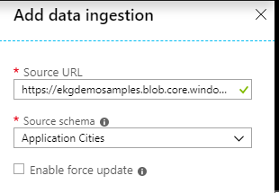

# Ingesting data to your graph

Once you've got your ontology, source schemas, and schema maps in palce, it's time for ingestion.

If you have previously carried out ingestion events, you will be able to see those in the interface. (Note that you may need to update the 'Start' time at the top left if your ingestion was in the past to make sure that the reporting time-window covers your ingestion event.)

If you have not previously completed ingestion events, you will not see any reporting here, and will instead see an icon inviting you to create your first ingestion.

Create a new ingestion by clicking on the '+Add' button at the top left, and you will see this window:

**Source URL:** The URL of the location of your source data. You may want to use <a href="https://azure.microsoft.com/en-us/services/storage/blobs/">Azure Blob storage</a>, but you can use any storage system. The source data format is covered in the source data conceptual overview.

**Source schema:** The schema for the source data that you are uploading.

**Enable force update:** The system will not generally re-ingest data that it has already ingested. However, in some cases you may want to force the re-ingestion of all data from a given source, and can use this checkbox to do so.

