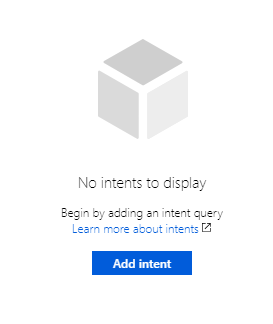
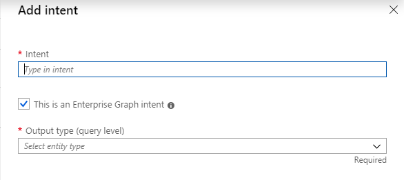
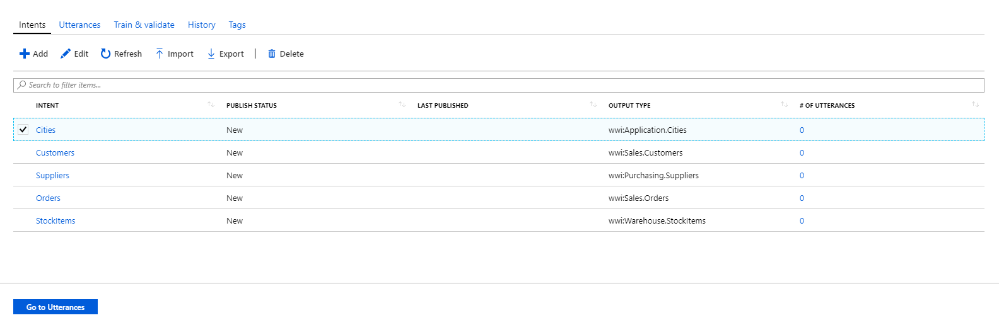
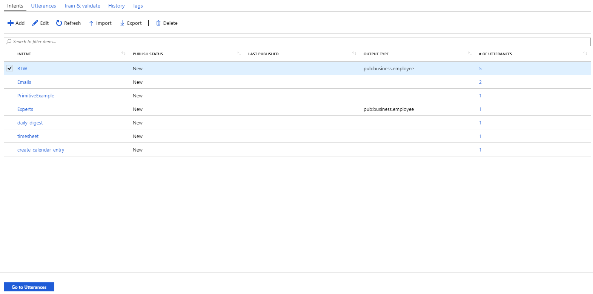
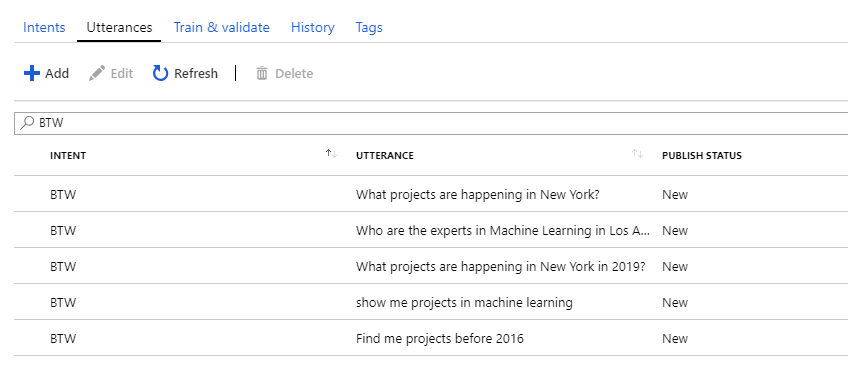
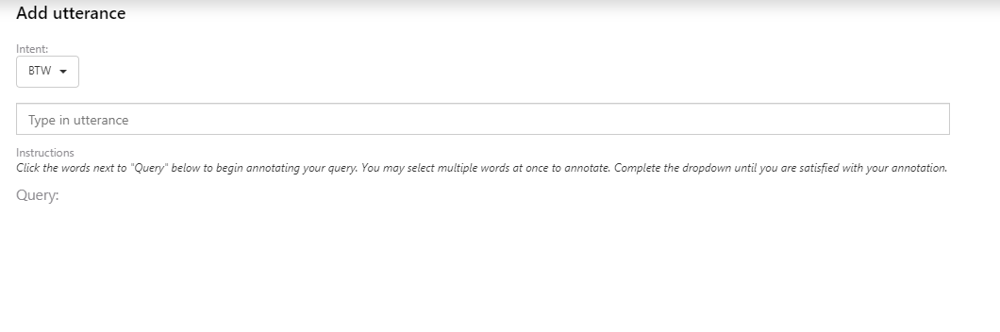
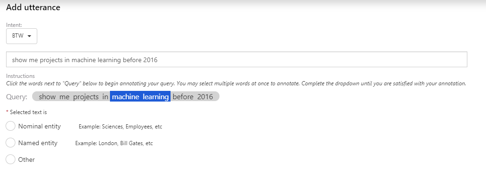
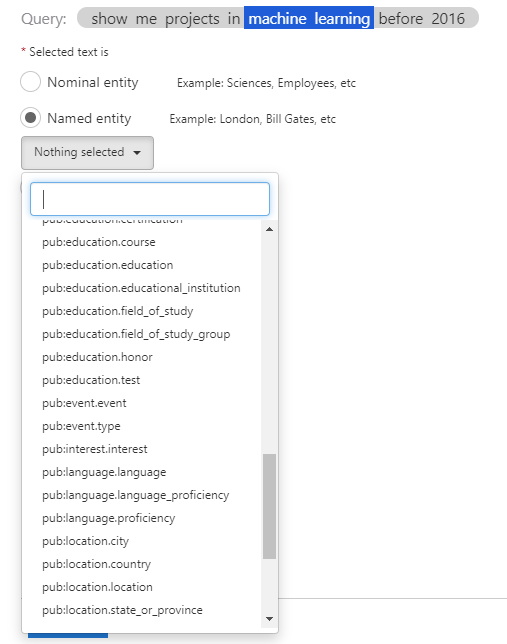
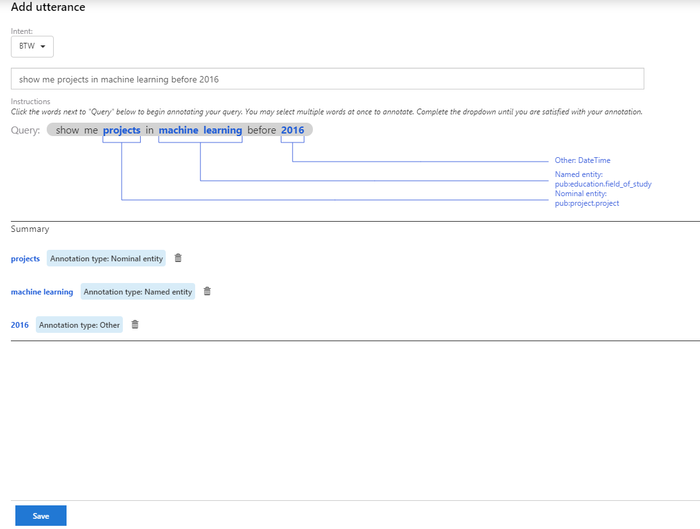
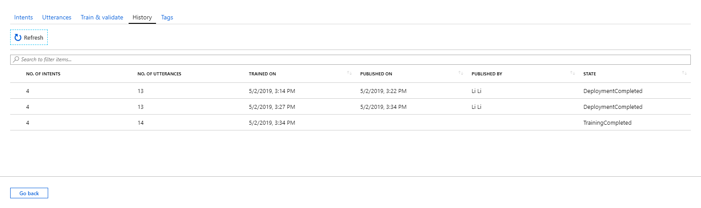

# Tutorial: Create an intent classifier model

In this tutorial, you'll learn to:

> [!div class="checklist"]
> * Add an intent
> * Add an utterance
> * Train, validate and publish the model
> * Check the history of models
> * Manage customerized tags

## Prerequisites

- Have completed all the essicential steps to build the graph.
- Familiarity the basic [concepts of intent classifier](intent-classifier-overview.md)

## Add an intent

If you have not previously created any intents, you will see an icon along with a short instuction message inviting you to add your first intent, as shown in the window:



Click on the 'Add intent' button, and you will see the a panel window launched from right side:



**Intent:** The meaningful name for the intent.

**This is an Enterprise Graph intent:** The checkbox is selected by default which means the intent is querying an existing type in the graph.

**Output type (query level):** The output type of this intent, i.e. the entity type in the graph which is refered by the intent.

After you finished all the required fields and click on the "OK" button at bottom, the new intent will be displayed in a grid as below:



Now, you can select the intent and click the "Go to Utterances" button to create utterances in the intent.

## Add an utterance

You can add new utterance to your intent. On the intent page, you can choose an intent from the list and click the 'Go to utterances' button on the bottom:



You will see this page:



To add a new utterance, you can click the 'Add' button on the toolbar, then you will see this view:



You can type in an utterance that you come up with, after this, a query will be shown on the bottom where you can add the annotations. 

There are three types of annotations: ```Nominal entity```, ```Named entity``` and ```Other```. For example, you can annotate 'Sciences' or 'Employees' as ```Nominal entity``` and annotate 'London' or 'Bill Gates' as ```Named entity```. For ```Other```, it is for primitive type or custom tag.

To add an annotation, you can select the words by clicking them, you may select multiple at once to annotate. Then you will see the raio buttons.



For example, we are annotating 'machine learning'. We can select ```Named entity``` and then choose the corresponding 'Entity type' from your published ontology. 



Similarly, we can add a ```Nominal entity``` annotation.

For custom tag, you can either choose from the history list or add a new one by clicking 'Add custom tag':


After annotating, you will see the view below. If you want to change the annotating, you can delete the annotation in the 'Summary' section and annotate again by following the steps above. If your annotating is completed, you can click the 'Save' button on the bottom.



## Train, validate and publish the model


## Check the history of models

Under the "History" tab, you can check the trainning and publishing history for intent classifier models. An example for the history grid is showing as below:




## Manage customized tags

Under the 'Tags' tab, you can manage all of your customized tags. For adding a new tag, besides doing it under this 'Tags' tab, you can also do it in-place when you create new utterance.

> [!IMPORTANT]
> If you delete a tag that is being used in utterances, the corresponding annoataion tag will be removed from the affected utterances as well.
> Similarly, if you edit a tag that is being used in utterances, the corresponding annoataion tag will be updated automatically.