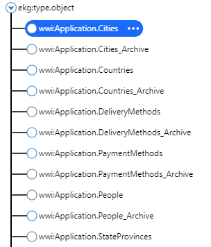
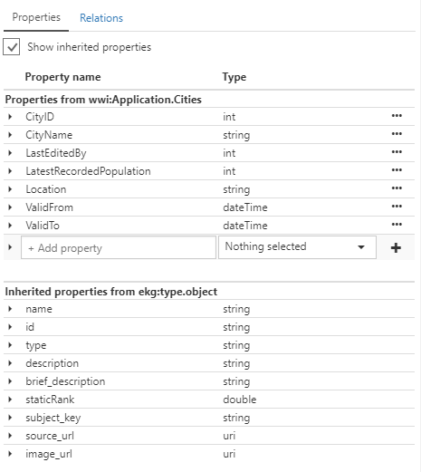
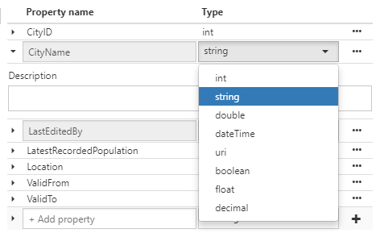
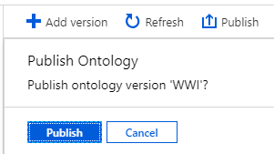

# Tutorial: Create an intent classifier model


## Prerequisites


## Add an intent


## Add an utterance


## Train, validate and publish the model


## Check the history of models


## Manage customerized tags


XXX TO DO XXX

To set up a new ontology, you can import one you have already, start with one of those we have pre-supplied, create a new ontology from scratch using the editor, or clone from an earlier ontology version that you have already created in Enterprise Graph.


In this tutorial, we are using the sample ontology from the quickstart.

From the 'Select version' option in the top left, you can see the published and unpublished versions of your ontology:


In the left pane, you can see the entity types that make up your ontology:



And by selecting one of the entities, you can see a graphical view of its relationships in the next pane to the right. For example, here is the view for ```wwwi.Application.Cities```:


Note that that this view shows one 'level' of connection within the graph. You can explore deeper connections by changing the 'Graph Depth' setting in the view pane. Here for example is the same entity viewed with the view '2nd degree connections':


You can click on individual entity types to move them around, and also click and drag on the view itself. You can zoom in and out with the on-screen controls, or the scroll-wheel of your mouse if you have one.

In the right-hand side pane you can see the property details for the selected entity:


You can also use the checkbox selector to 'Show inherited properties', which will show the properties for this entity type itself, and also the properties it has inherited from other entities:



Note that the cities entity inherits from ```ekg:type.object``` which is the root object for all entities in the ontology, and contains properties that are common to all entities like name, description, subject key, and so on.

You can make changes to the properties for a given entity right from the property panel by choosing the three dots and then 'Edit' for whatever property you wish. You can also add new property types.

The 'Type' for each property means what type of value it is from common data types like int, string, dateTime and so on:



> [!IMPORTANT]
> You cannot make changes to a published ontology. Make your changes in a new version, then publish the new version.

Once you have made all your changes, you can publish the new ontology version:




> [!IMPORTANT]
> To completely delete an ontology and replace it with a new one, please see the 'deleting your ontology' tutorial.
