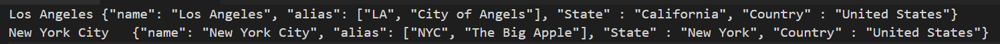
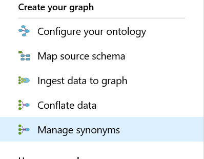
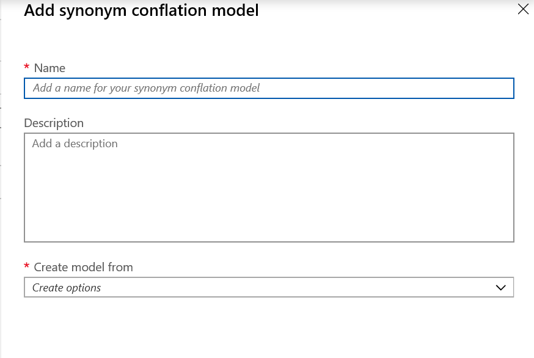
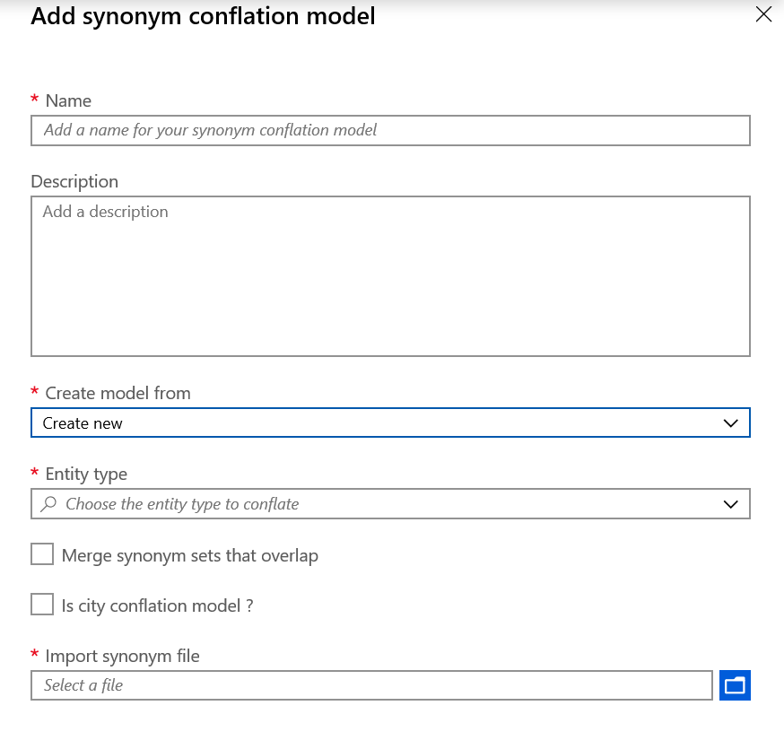
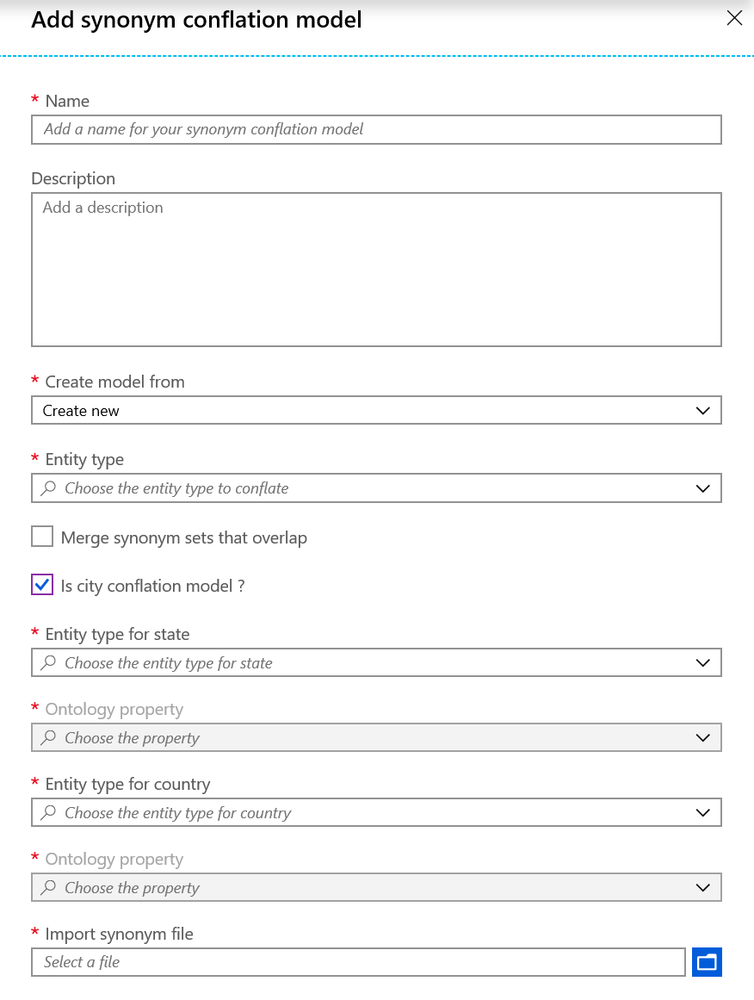
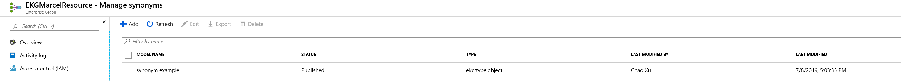

# Tutorial: Manage synonyms
In this example, let's create a synonym conflation model to apply to the Customer entity type.

## Prerequisite
* [create an ontology](/create-ontology.md)
* [create source schemas](/create-source-schema.md)
* [create schema maps](/schema-map-tutorial.md)
* [Ingest data to your graph](/ingest-data.md)

## Create a conflation synonym model

### Create synonym file

Creating a synonym file has the same process as the process to create a [conflation model](conflation-concepts.md). A conflation model is a model that conflates multiple entities into one. Before we start to create a synonym model in the Azure portal, we need to create a tsv file known as the **synonym file**. In this file, we need to define what are the synonyms for each entity name. For example, *New York City* is also known as *The Big Apple*. Similarly, *Los Angeles* is sometimes called the "City of Angels."  We can create the following synonym file for these examples:

 

The synonym file is a tsv file. The file has two main components: the entity name and a JSON body. The JSON body comprises of a name, alias, state, and country. The state and country properties are only required for city type entities.

After creating the synonym file, we can now navigate to the Azure portal to create a synonym model.

### Generate synonym model

In the Azure portal, navigate to the **Manage synonyms** tab of the tab list:

 

Click **+Add** at the top left, and you'll see the new creation model window:

 

Choose a name and optionally add a description.

Under the 'Create model from' option, if you choose 'Create New', you'll see additional options:

 

 When you click the Entity type, you can choose one type of entity from the drop-down list you want to conflate with. If you don't see any thing from the drop-down list, there could be something wrong with the source schema. Make sure that the schema map has been created correctly. If there are two sets of synonyms which have a lot of the same words, you can check the box **Merge synonym sets that overlap**. Another consideration is that specifically for *city* entity type, check the **Is city conflation model** option. Once you checked it, four more sections are provided to fill.

  

In the newly prompted input blocks, you need to provide the entity type and ontology property for both state and country entities. These options are extremely important, as demostrated in the following example. The graph could contain confusing data such as Vancouver, WA, USA and Vancouver, BC, Canada. If you don't provide the state and country values correctly, the system may conflate the two entities together as one entity. By providing the state and country values, the conflation system will understand that the two Vancouver entities are different entities and won't conflate them.

Finally, click the **Import synonym file** to upload the synonym file we created at the beginning of this section. Next, click the **Add Model** button, you're successfully created a synonym model for your conflation system.

Once you saved your synonym model, it will show up in your **Manage synonyms** portal.

  

As the picture shows, as long as your synonym model status is **Published**, your synonym model is successfully registered. With future data ingestions, the synonym conflation will work as you defined.
