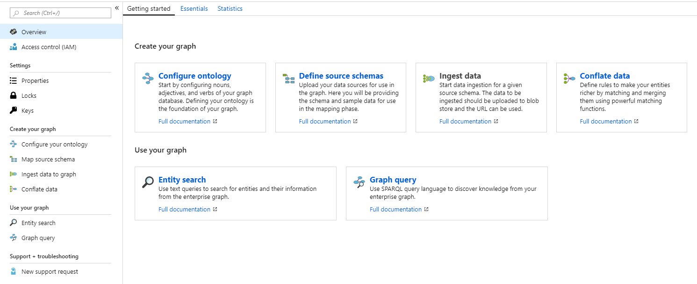
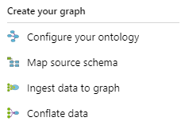
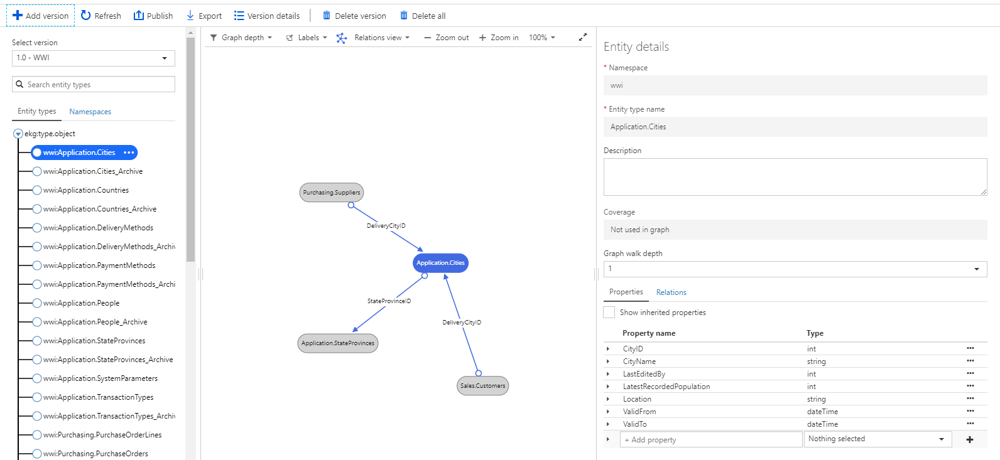
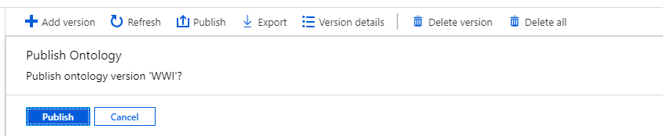
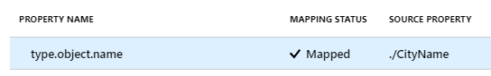
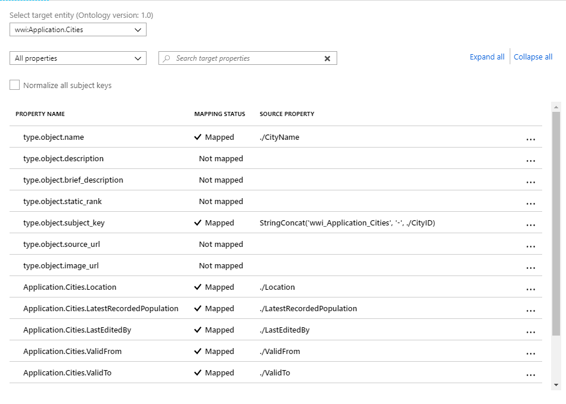
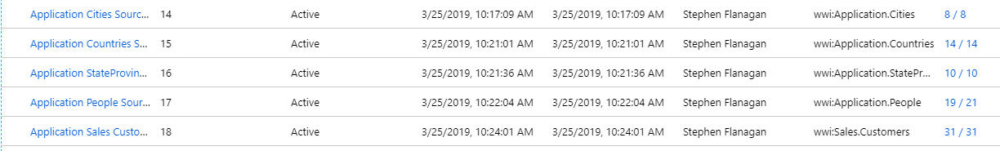
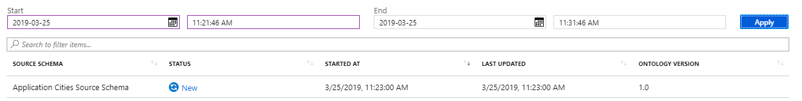
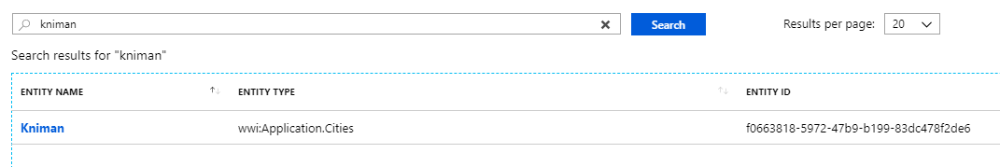

# Building your first graph

To get started with the Enterprise graph, we've provided everything you need to complete the graph-build process end to end.

FILE AVAILABILITY NEEDS TO BE UPDATED

You can download the sample files we use for this quick-start here <a href="https://ekgdemosamples.blob.core.windows.net/ekgdemosamples01/EGDemo_WWI_Files.zip">here</a>.

## (1) Creating an ontology

Your ontology contains the definitions of the entities you want to use and what properties and relationships they have. The ontology defines the entity types, and then later we'll import data to create actual entities. For example, in this step we'll define a 'City' entity that has a 'CityName' property, and later on we'll create actual city entites, e.g. Kniman, Cubero and so on.

All of the steps you will complete in the graph creation process are laid out in the interface:



To get started, choose **Configure Ontology** from the Overview page, or choose the **Configure your ontology** option from the menu blade.



Click on the **+Add** button, and you'll see the **Create ontology** pane.


In this pane, you can see there are options to create an ontology from scratch, modify one of the Microsoft-supplied ontologies, or import an existing ontology. For now, we're going to import an existing ontology, based on the <a href="http:///www.microsoft.com">World Wide Importers sample data</a>.

In the ontology pane, choose a suitable name (like 'WWI'), add a description if you want, choose the 'Import' option from the 'Add ontology from' dropdown,and then choose the '01_WWIOntology.json' file from the sample files.


Once the ontology is created, you can examine the different entity types and the attributes they have through the browser. In the screenshot below for example we can see the ```Application.Cities``` entity type. We can also see that two other entities link to the ```Cities``` entities - ```Purchasing.Suppliers``` and ```Sales.Customers```. We can also see that ```Application.Cities``` itself links to the entity ```Application.StateProvinces``` with a link type of 'StateProvinceID' showing the province the city is located in.



To complete this step, choose **Publish** to put your ontology live.



> [!TIP]
> If you don't publish your ontology here, you won't be able to complete the later steps.

## (2) Creating and mapping source schema

Now that we have our ontology in place, we can move to the next step: relating the ontology to your source data. Your 'source data' is the data you intend to upload to your graph.

First, we want tell the system what fields your source data contains. Your source data must be formatted as a TSV, and in this step 'Sample data' means a sample of the data you ultimately intend to upload.

In the sample data we've provided, there are five source schemas:

1. 02_Schema_Application.Cities.json
1. 03_Schema_Application.Countries.json
1. 04_Schema_Application.StateProvinces.json
1. 05_Schema_Application.People.json
1. 06_Schema_Sales.Customers.json

In each case, what the source schema is saying is: 'These are the headings of the data I intend to upload.'


1. Click on **+Add** to upload a source schema file
1. Choose an appropriate name, e.g. 'Application-People'
1. Choose the 'Upload a JSON file' option
1. Choose the 02_Schema_Application.Cities.json file to upload

You'll see the file previewed in 'Sample Data' window, and you can click OK.

Repeat these steps for all of the source schema files, and you'll see a view like this:


You'll see that the last column says 'No fields mapped' - in other words, we have defined our ontology and we've defined what our source data looks like, but we have not defined the links between them. We'll add this mapping now.

Click on **No fields mapped** for Cities, and then choose ```wwi.ApplicationCities``` as the **Target Entity** on the left-hand side.


On the left you're seeing your ontology (specifically, the entity for cities) and on the right you're seeing the schema map of your own data.

Next we want to specify that CityName in our input data should be the source data for the ```type.object.name``` property for the ```wwi:Application.Cities``` entity type. To do that, we select CityName on the right, then click on type.object.name on the left.


Once you click 'OK', you'll see confirmation this mapping is now in place:



To complete this step, we have provided XML mapping data files. Go ahead and upload those now for each of the provided files. In each case, choose the entity and the matching mapping file:

* wwi: Application.Cities -> 07_Mapping_Application.Cities.xml
* wwi: Application.Countries -> 08_Mapping_Application.Countries.xml
* wwi: Application.StateProvinces -> 09_Mapping_Application.StateProvinces.xml
* wwi: Application.People -> 10_Mapping_Application.People.xml
* wwi: Sales.Customers -> 11_Mapping_Sales.Customer.xml

When you upload the file you'll see the mapping complete view:



And then when you click 'Verify', you'll see the final mapping in place:


When you've complete the mapping step, you can see the schema mapping status for each of your source schemas:



Now that source schemas and schema maps are in place, we can ingest data to the graph.

## (3) Data ingestion

The input data for your graph comes from the input data you want to use in a TSV format. The easiest way to handle the import is to use Azure Blob Storage, and that is where we have put the sample data for you import. The URLs for each kind of sample data are:

* https://ekgdemosamples.blob.core.windows.net/ekgdemosamples01/12.1_Ingestion_Application.Cities.tsv
* https://ekgdemosamples.blob.core.windows.net/ekgdemosamples01/12.2_Ingestion_Application.Countries.tsv
* https://ekgdemosamples.blob.core.windows.net/ekgdemosamples01/12.3_Ingestion_Application.StateProvinces.tsv
* https://ekgdemosamples.blob.core.windows.net/ekgdemosamples01/12.4_Ingestion_Application.People.tsv
* https://ekgdemosamples.blob.core.windows.net/ekgdemosamples01/12.5_Ingestion_Sales.Customers.tsv

Navigate to the **Ingest data to graph** section, choose **+Add** at the top, and you'll options for 'Source URL' and 'Source Schema':


'Source URL' is where your input data can be found (i.e. in this case the blob store URL we provided above), and 'Source Schema' is the source schema we created in step (2) above to map this input data.

When the ingestion completes, you'll see this view:



Repeat the process for each source data TSV and matching source schema, and you'll see:


## (3) Querying your graph

Your first graph on the Enterprise Graph platform is complete, congratulations! To run a simple text query, navigate to the **Use your graph** section of the interface from the left-hand navigation pane, and choose 'Entity Search'. Enter the query 'kniman', and you should see:



You can click on the entity name to see the details the graph contains about it:


## (4) Conflation

When you are building your own graphs, the next step is conflation. We won't cover that in this quickstart guide - check out the details [here](/conflation-concepts.md).


