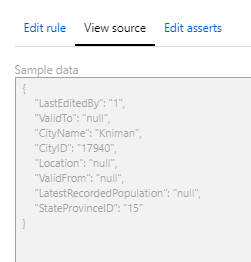
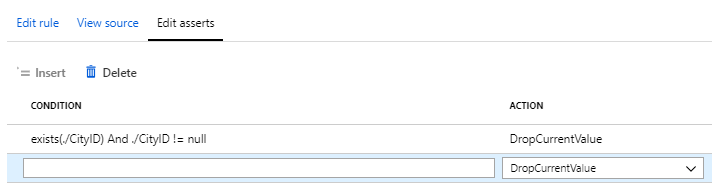
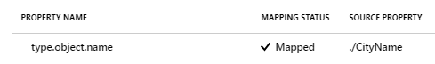
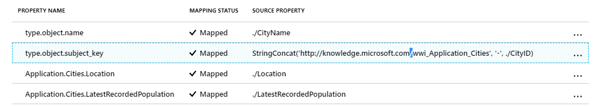
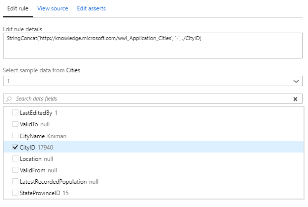
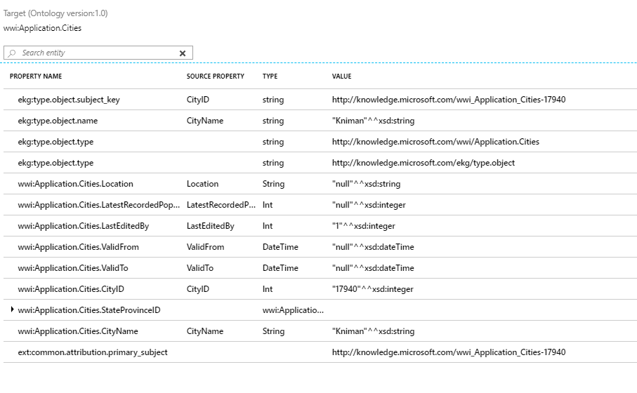

# Schema maps

There are two main tasks in the schema mapping state - mapping your data to your ontology, and defining a subject key. 

## Mapping your data

Once you have completed your source schemas, the data still needs to be mapped to your ontology.

As per the quickstart example, if you click on 'No fields mapped' and choose ```wwi.ApplicationCities``` as the **Target Entity**, you will see this view:


The left side of the page shows your ontology and the mapping status for each property. When we see the 'Not mapped' status, we know that the property exists in the ontology, but there is no source data for it yet. 

On the right-hand side of the page, we can see the mapping options.

If you click on the 'View Source' tab, you can get a preview of the source data you are mapping, as you set it up in your source schema:



Under the 'Edit Asserts' tab you can set rules for what to do in the event of missing data:



Click on the 'Add suggested asserts' button to get automatic suggestions, for example in this case that the current value should not be imported if the CityID is missing.

Once you have created a mapping between a source property and a graph property, you can see the status reported as 'Mapped':



In this case, we are seeing that the property ```type.object.name``` is mapped to value coming from the source property called 'CityName'.

## Choosing a subject key

A **subject key** is an identifier you choose which will be associated with each entity that is created when data is ingested. If the subject key for a new entity is the same as the subject key for an existing entity already in the graph, then the system knows they actually refer to the same entity, and the entities should be merged.

(This may sound similar to conflation - the difference is that with conflation, we are merging entities from different data sources, whereas the subject key is used to merge entites from within the same data source.)

In the next screenshot, we can see that the subject key for the ```type.object.subject_key``` property for the ```Application.Cities``` entity type is defined as a the string concatenation:

```StringConcat('http://knowledge.microsoft.com/wwi_Application_Cities', '-', ./CityID)```

In the interface, this looks like:



That means for every ```City``` entity that is created, each one will have a subject key formed by the concatenation rule.

You set the rule in the 'Edit rule' section of the interface:



Rules can be applied to any graph property, not just the subject key. For example, with a ```Person``` entity you may want to set a concatenation rule to create a property type called ```person.FullName``` which is a concatenation of source data for FirstName, a space or comma, and LastName (assuming those fields were in the source data and had been mapped in a source schema).

## Verifying your mapping

Once you've created your mapping, including the creation of a subject key, the final step is to verify. When you click on the 'Next - Verify mapping' button, you will see a view like:



This view shows the name of the property in the graph, the name of the source property, the type of data that is mapped (a string, an integer, a DateTime object etc), and a sample value of the mapped data. 

We can see in the screenshot for example that the property ```type.object.name``` for the entity type ```wwwi:Application.Cities``` will be populated from the source property CityName, and a sample value of that will by the string 'Kniman'. (Kniman is the name of a city in the sample source data we are using.)

> [!div class="nextstepaction"]
> [Ingest your data](ingest-data.md)

